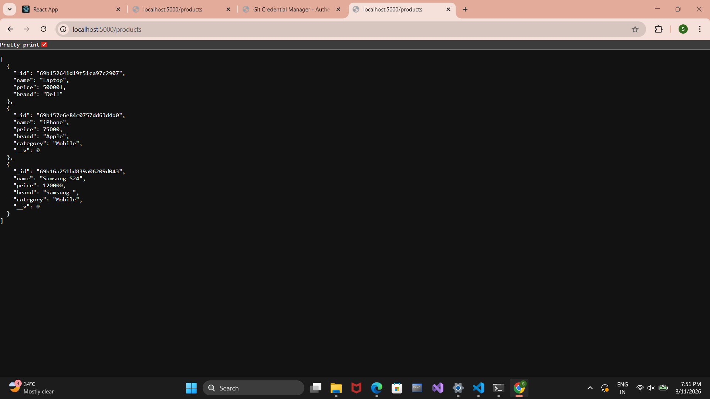

# 🛒 MERN E-Commerce Dashboard

A simple **MERN Stack CRUD Dashboard** where users can manage products.
This project demonstrates **Create, Read, Update, Delete (CRUD)** operations using **MongoDB, Express, React, and Node.js**.

---

# 🚀 Features

✔ Add new products
✔ View product list
✔ Update product details
✔ Delete products
✔ Backend REST API using Express
✔ MongoDB database integration

---

# 🛠 Tech Stack

Frontend

* React.js
* CSS

Backend

* Node.js
* Express.js

Database

* MongoDB

Tools

* Git
* GitHub
* VS Code

---

## 📷 Screenshots

### Product List Page


### Add Product Page


### Backend API Response



---

# ⚙️ Installation

Clone the repository

```
git clone https://github.com/sumitsg0509/Mern-ecommerce-dashboard.git
```

Go to project folder

```
cd Mern-ecommerce-dashboard
```

Install dependencies

```
npm install
```

Start backend server

```
node index.js
```

Start React frontend

```
npm start
```

---

# 📂 Project Structure

```
Mern-ecommerce-dashboard
│
├── Backend
│
├── front-end
│
├── screenshots
│   ├── product-list.png
│   ├── add-product.png
│   └── api-response.png
│
├── package.json
└── README.md
```

---

# 👨‍💻 Author

**Sumit**

GitHub
https://github.com/sumitsg0509
