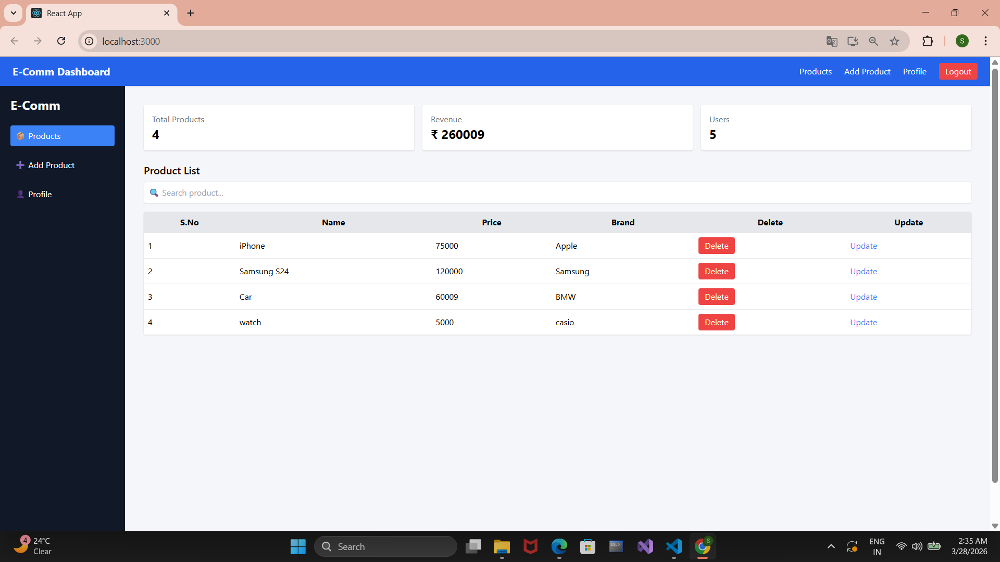
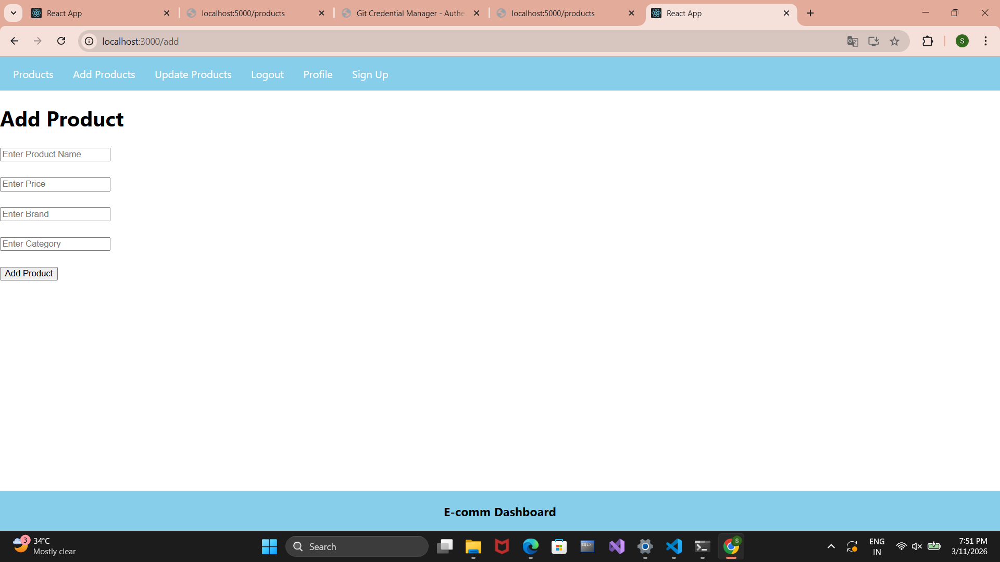
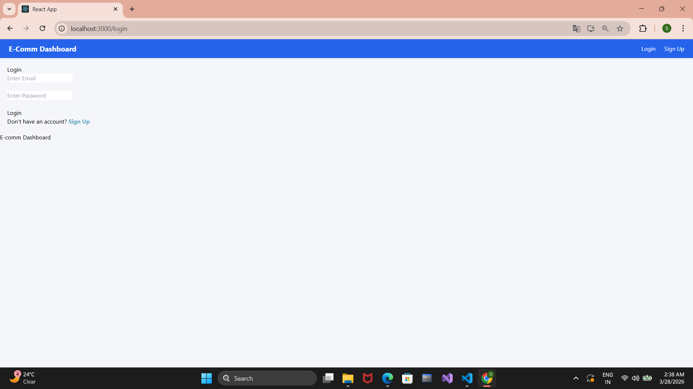

# 🛒 MERN E-commerce Admin Dashboard

A full-stack **MERN (MongoDB, Express.js, React, Node.js)** based Admin Dashboard to manage products with secure authentication and modern UI.

This project allows users to register, login, and manage products efficiently including adding, updating, deleting, and searching products with a clean and responsive dashboard interface.

---

# 🚀 Features

✔ User Registration & Login
✔ JWT Authentication (Secure Access)
✔ Protected Routes
✔ Add Product
✔ Update Product
✔ Delete Product
✔ Product Search (with Debounce Optimization)
✔ Dashboard Analytics (Total Products, Revenue, Users)
✔ Responsive UI using Tailwind CSS
✔ Sidebar Navigation

---

# 🛠 Tech Stack

### Frontend

* React.js
* React Router
* Tailwind CSS

### Backend

* Node.js
* Express.js

### Database

* MongoDB
* Mongoose

### Authentication

* JSON Web Token (JWT)

---

# 📂 Project Structure

Backend
│
├── models
│   ├── Product.js
│   └── User.js
│
├── index.js

front-end
│
├── public
├── src
│   ├── components
│   ├── App.js

screenshots
README.md

---

# ⚙️ Installation

### 1️⃣ Clone the repository

```bash
git clone https://github.com/sumitsg0509/Mern-ecommerce-dashboard.git
```

### 2️⃣ Install backend dependencies

```bash
cd Backend
npm install
```

### 3️⃣ Install frontend dependencies

```bash
cd ../front-end
npm install
```

### 4️⃣ Start Backend Server

```bash
cd Backend
nodemon index.js
```

### 5️⃣ Start Frontend

```bash
cd front-end
npm start
```

---

# 🌐 API Routes

| Method | Route        | Description      |
| ------ | ------------ | ---------------- |
| POST   | /register    | Register User    |
| POST   | /login       | Login User       |
| GET    | /products    | Get All Products |
| POST   | /add-product | Add Product      |
| PUT    | /product/:id | Update Product   |
| DELETE | /product/:id | Delete Product   |
| GET    | /search/:key | Search Product   |

---

# 📸 Screenshots

### Product List


### Add Product


### Login Page


---

# 🚀 Improvements

* Implemented JWT-based authentication for secure access
* Added search functionality with debounce optimization
* Enhanced UI using Tailwind CSS
* Built dashboard analytics section
* Improved overall user experience

---

# 👨‍💻 Author

**Sumit**
MSc Computer Science Student
MERN Stack Developer 🚀

---

# ⭐ Support

If you like this project, please give it a ⭐ on GitHub.
